 # Praktikum 5
 
  ## Soal Latihan
  

1.Buat sebuah list sebanyak 5 elemen dengan nilai bebas

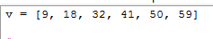

2.akses list:

- tampilkan elemen ke 3

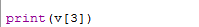
   
- ambil nilai elemen ke 2 sampai elemen ke 4

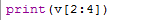

- ambil elemen terakhir

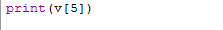

- Hasil ketika sudah di jalankan

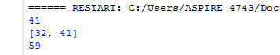

3.ubah elemen list:

- ubah elemen ke 4 dengan nilai lainnya

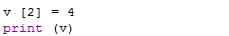

- ubah elemen ke 4 sampai dengan elemen terakhir

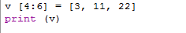

- Hasil kerika di jalankan

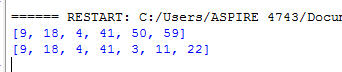

4. tambah elemen list:

- ambil 2 bagian dari list pertama (A) dan jadikan list ke 2 (B)

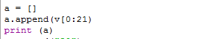

- tambah list B dengan nilai string

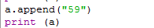

- tambah list B dengan 3 nilai

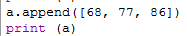

- gabungkan list B dengan list A

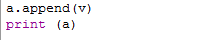

- Hasil ketika di jalankan

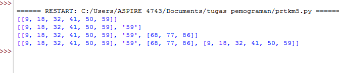

## TUGAS PRAKTIKUM

Buat program sederhana untuk menambahkan data kedalam sebuah
list dengan rincian sebagai berikut:
- Progam meminta memasukkan data sebanyak-banyaknya (gunakan
perulangan)
- Tampilkan pertanyaan untuk menambah data (y/t?), apabila jawaban
t (Tidak), maka program akan menampilkan daftar datanya. 
- Nilai Akhir diambil dari perhitungan 3 komponen nilai (tugas: 30%,
uts: 35%, uas: 35%)
- Buat flowchart dan penjelasan programnya pada README.md.
- Commit dan push repository ke github

# Langkah-langkah yang di gunakan

- Membuat list pada variabel 

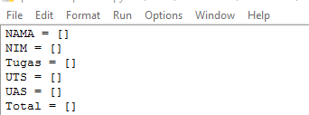

- Kita akan membuat program perulangan agar kita bisa memasukkan data sebanyak-banyaknya

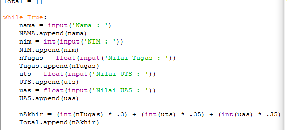

- Kemudian kita akan membuat program pilihan (Y/T)?, Yaitu ketika kita akan menginputkan Y,maka langsung pada saat itu akan muncul atau di minta untuk mengisi data kembali, Tetapi pada saat kita ingin menginputkan T, Maka program yang kita tadi jalankan akan berakhir dengan menampilkan hasil inputan yang tadi kita buat

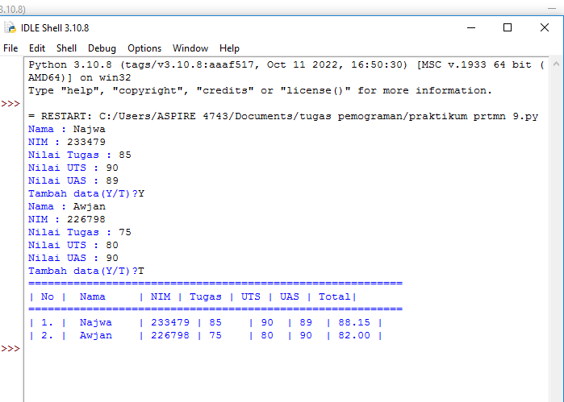

- FLOWCHART PRAKTIKUM 5

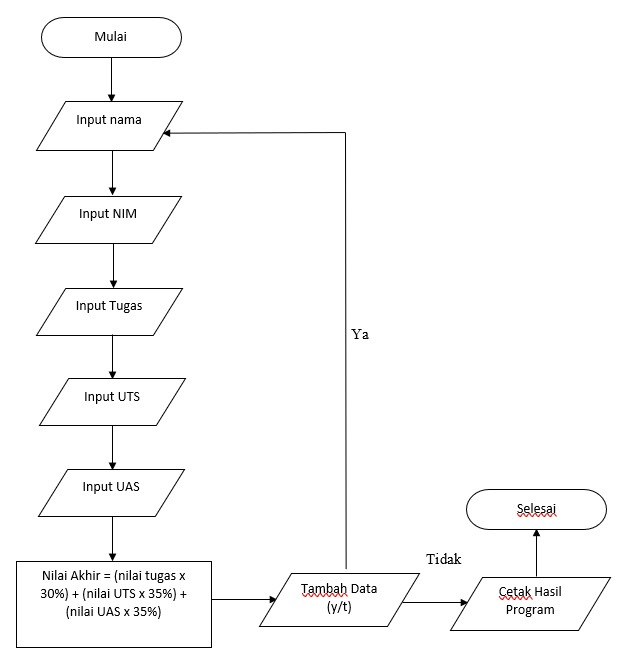
